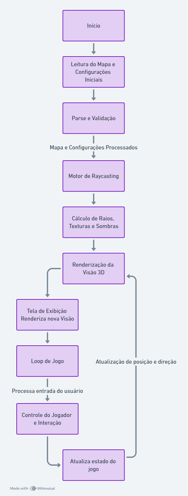

# cub3D

1. _Motor de Raycasting:_

   - _Entrada de Dados:_ Posição atual do jogador, direção da visão, e o mapa do jogo.
   - _Processamento:_
     - Cálculo dos raios projetados da posição do jogador em direção ao mapa para determinar visibilidade, distâncias e colisões.
     - Determinação das texturas e sombras com base na intersecção dos raios com os elementos do mapa.
   - _Saída:_ Dados de renderização (distâncias, ângulos, texturas) para serem usados na geração da visão 3D.

2. _Renderização da Visão 3D:_

   - _Entrada de Dados:_ Dados de renderização do motor de raycasting.
   - _Processamento:_ Geração da visão 3D usando os dados de renderização, aplicando texturas, ajustando perspectiva e sombras conforme necessário.
   - _Saída:_ Imagem 3D a ser exibida na tela.

3. _Controle do Jogador e Interação:_

   - _Entrada de Dados:_ Comandos do usuário (movimento, olhar ao redor).
   - _Processamento:_ Atualização da posição e direção do jogador com base nos comandos.
   - _Saída:_ Novas posições e direções enviadas ao motor de raycasting.

4. _Fluxograma do Projeto:_

